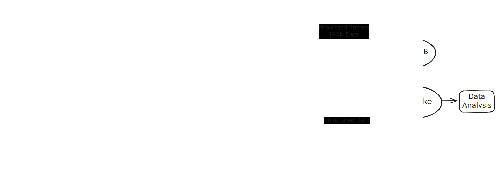

# E- Ticatert Sitesi İçin Veri Mühendisliği

# Amaç
"Owl Shop" tarafından sürekli olarak üretilen e-ticaret verilerini (müşteri bilgileri, siparişler, web sitesi olayları) yakalayan, işleyen, depolayan ve analiz eden uçtan uca bir veri platformu tasarlamak ve mantığını kurmak.

# Teknolojiler
- Apache Kafka
- Apache Spark
- Apache Airflow
- MongoDB

# 📊 Akış Diyagramı
Aşağıda veri platformumuzun genel akışı yer almaktadır:



---

```plaintext

ecommerce_data_platform/

├── dags/ # Airflow DAG dosyalarımız burada yaşayacak
│ │
│ └── process_daily_data.py
│
├── data/ # Lokal Veri Gölümüz. Spark işlerinin sonuçları (Parquet) buraya yazılacak.
│ │
│ └── processed/
│ │
│ ├── customer_profiles/
│ │
│ └── sales_reports/Add commentMore actions
│
├── docker-compose.yml # Tek komutla tüm altyapıyı (Kafka, Mongo, Airflow vb.) başlatan dosya
│
├── notebooks/ # EDA
│  │
│  └── initial_data_exploration.ipynb
│
├── spark_jobs/ # Spark ile yazacağımız veri işleme betiklerimiz
│ │
│ ├── streaming_frontend_events.py
│ │
│ └── batch_process_orders.py
│
├── configs/ # Konfigürasyon dosyaları
│ │
│ └── owl_shop_config.yaml
│
└── README.md # Projenin ne yaptığını ve nasıl çalıştırılacağını anlatan ana dosya

```